# apm-ilx-sql-challenge
An iRulesLX extension written in JavaScript for hosting on F5 BIG-IP's NodeJS engine. F5's [Access Policy Manager](https://www.f5.com/products/security/access-policy-manager) (APM) integrates with this extension to query a SQL Server database for challenge questions during user authentication. While this example was created to integrate with Microsoft's SQL Server, this solution could easily be adapted to integrate with Oracle, Redis, MongoDB, etc.

This solution is intended to be used as an example to enhance an existing APM flow that already includes proper authentication & authorization schemes. This policy should not be considered an appropriate security measure when used by itself. It should only be considered as a fallback or additional challenge in a Multifactor Auth (MFA) environment.

# Requirements
- A BIG-IP with iRules LX and APM modules licensed. BIG-IP 13.1.1 was used for the creating and exporting of policies. While this solution can be created from scratch on other versions, BIG-IP will not permit importing a policy that was created in a different version.
- SQL Server database that the BIG-IP can connect to. You may use the scripts in the [sql-scripts](sql-scripts/) folder to create the Challenges table and GetChallenge stored proceedure that this example code uses. Once the table exists, populate it with Questions/Answers. Questions with single word answers are ideal for this application. [Azure Data Studio](https://docs.microsoft.com/en-us/sql/azure-data-studio/what-is?view=sql-server-2017) is a great tool for managing SQL Server databases.
- A BIG-IP virtual server for testing

# What does it do?

When the user connects to the virtual server with the policy, they will be challenged with a question to answer. 

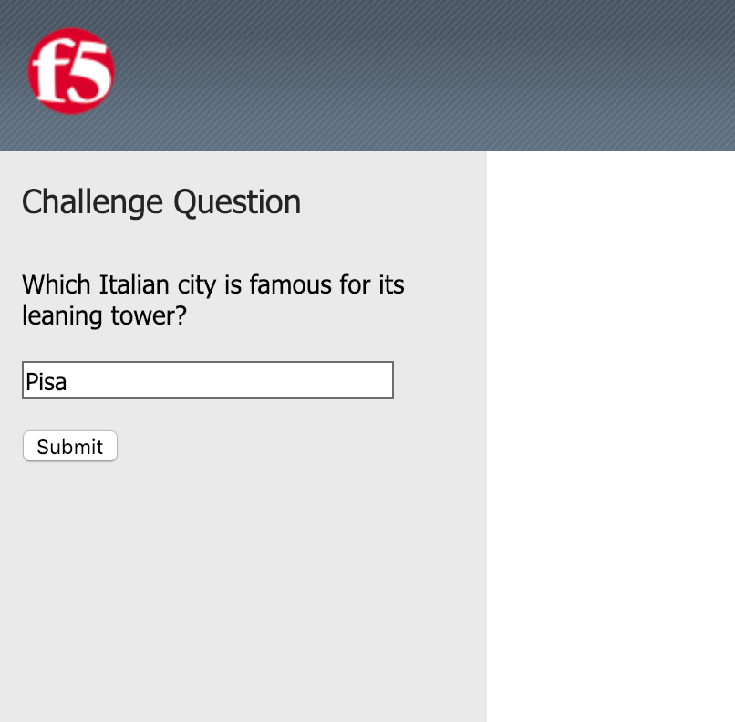

If the user answers the question correctly, they will be granted access to the protected applications or resources.

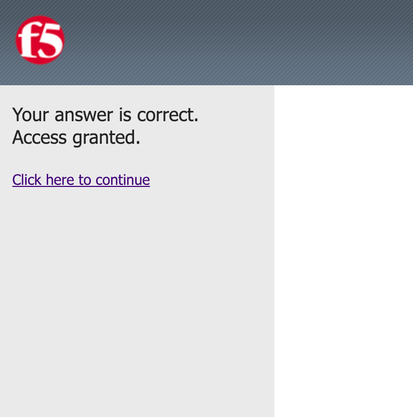

If the user answers the question incorrectly, they will be denied access to the protected applications or resources.

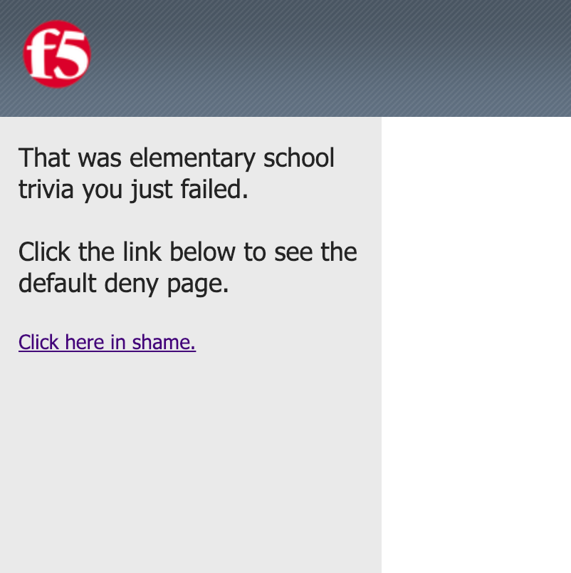

Incorrect answers will be logged in APM for auditing and troubleshooting purposes

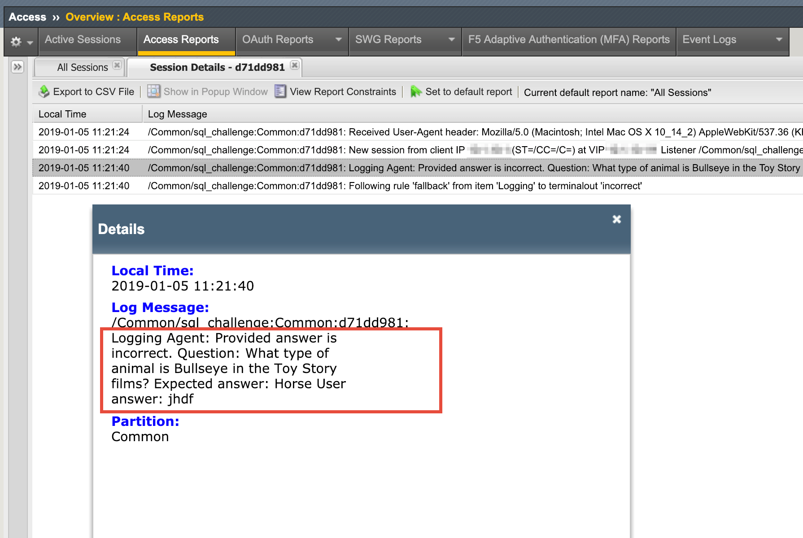

The access policy

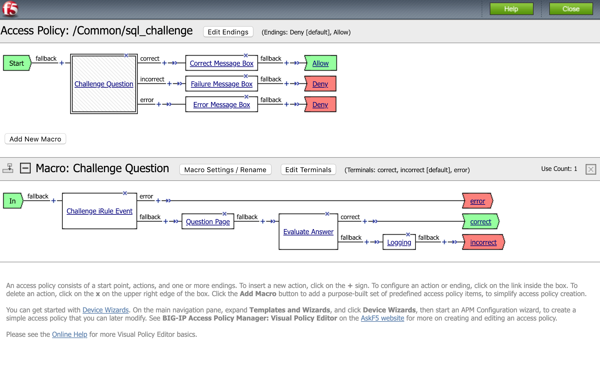

# Setup 
Provision the iRulesLX and APM modules on your BIG-IP if not already provisioned. (NOTE: perform this during a maintenance window; it will restart some BIG-IP services)

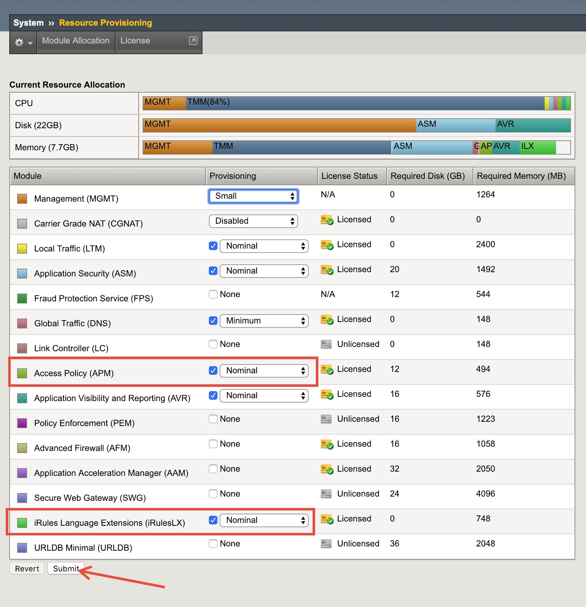

Import the [sql_challenge_ilx_workspace.tgz](dist/sql_challenge_ilx_workspace.tgz) iRulesLX workspace in the UI as pictured. Name the workspace whatever you prefer.

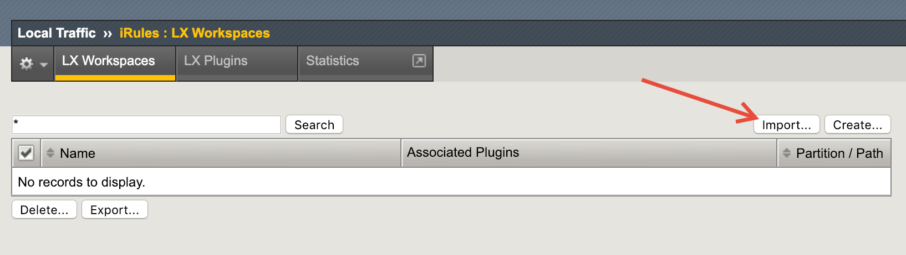
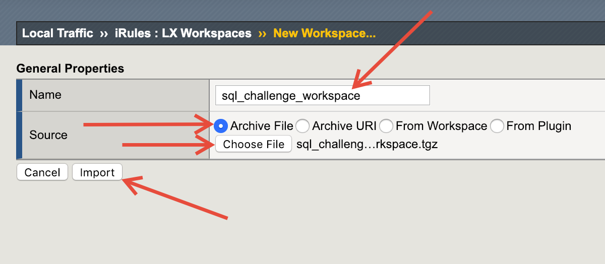

If you see the following error, it can be ignored. 

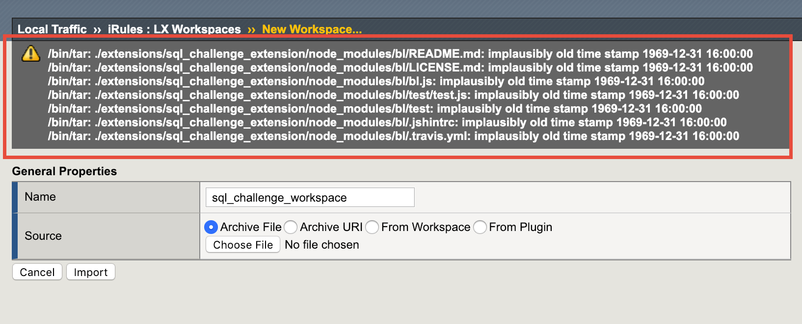

Create an iRules LX Plugin as pictured. Name the workspace whatever you prefer. Reference the iRules LX workspace name you have already created in the "From Workspace" dropdown menu.

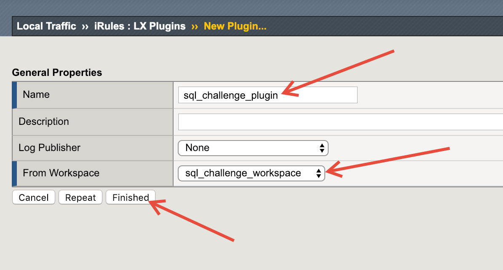

In the LX Workspaces page, click on the workspace you created

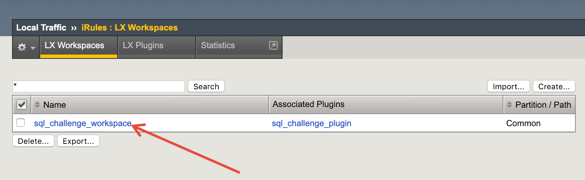

Click on the index.js file on the left. On the right panel, update the SQL Server connection variables at minimum. If you need to alter the SQL Server queries that are called from this extension, you may also do so. Click Save File, then click Reload From Workspace. Click OK on the dialog that follows.

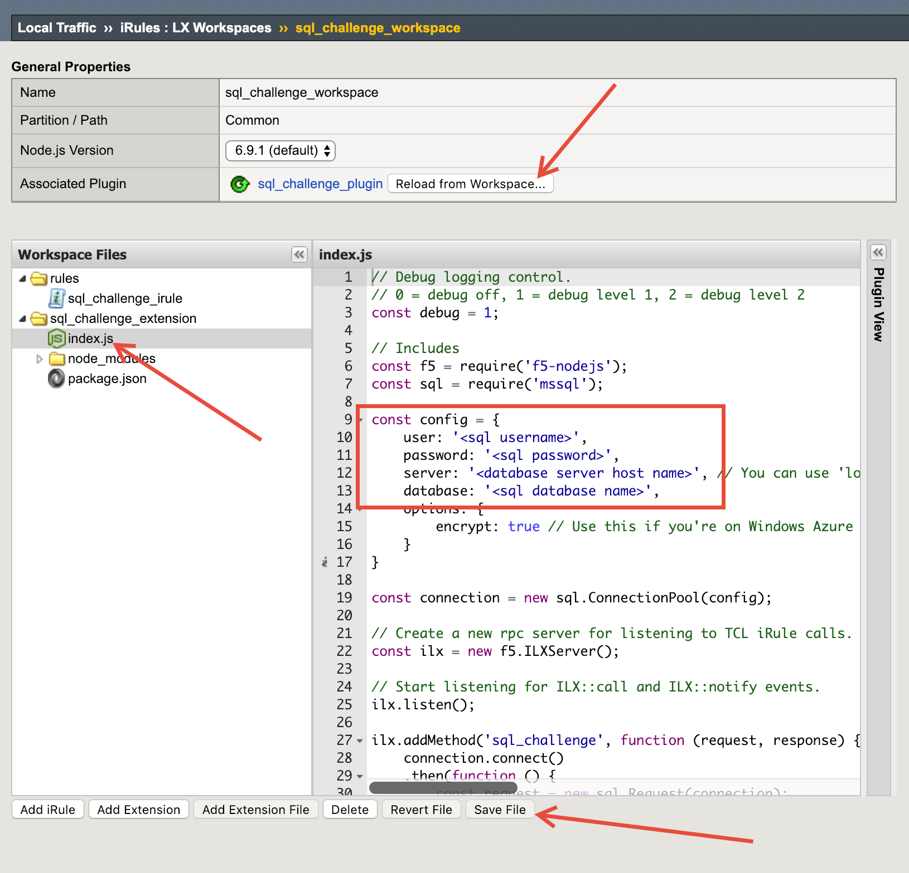

Import the Per-Session Access Policy

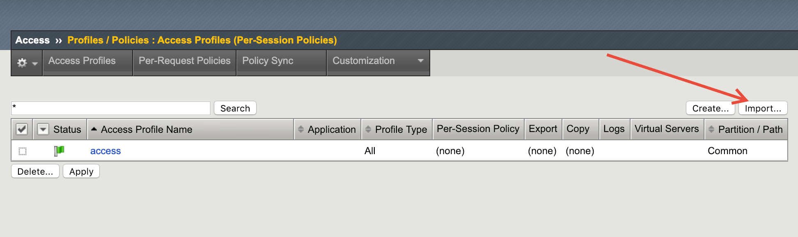

Name the policy as you wish, then select the [apm_profile_Common_sql_challenge.conf.tar.gz](dist/apm_profile_Common_sql_challenge.conf.tar.gz) and click the Import button

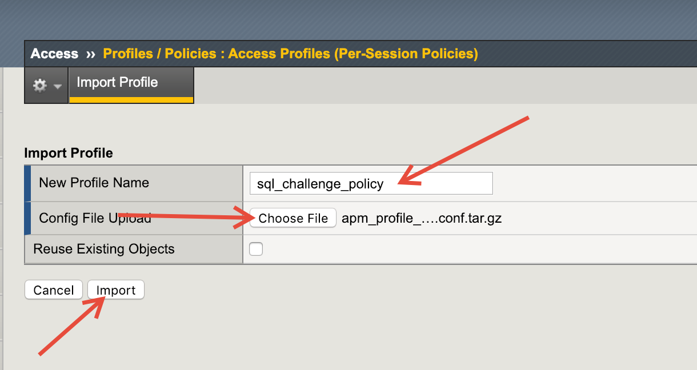

Select the checkbox next to your new policy, and click Apply

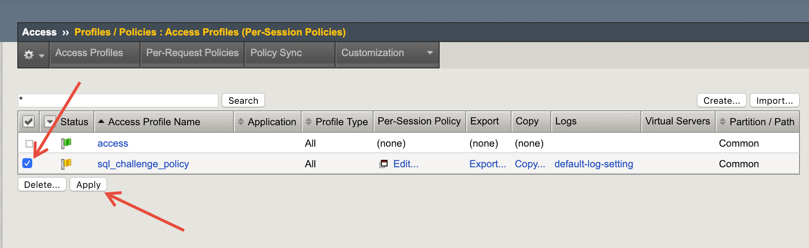

Create a new (or use an existing) Virtual Server. Creating a new virtual server is out of scope for these instructions. In the Virtual Server's advanced settings, select the access profile you created above. Click Update.

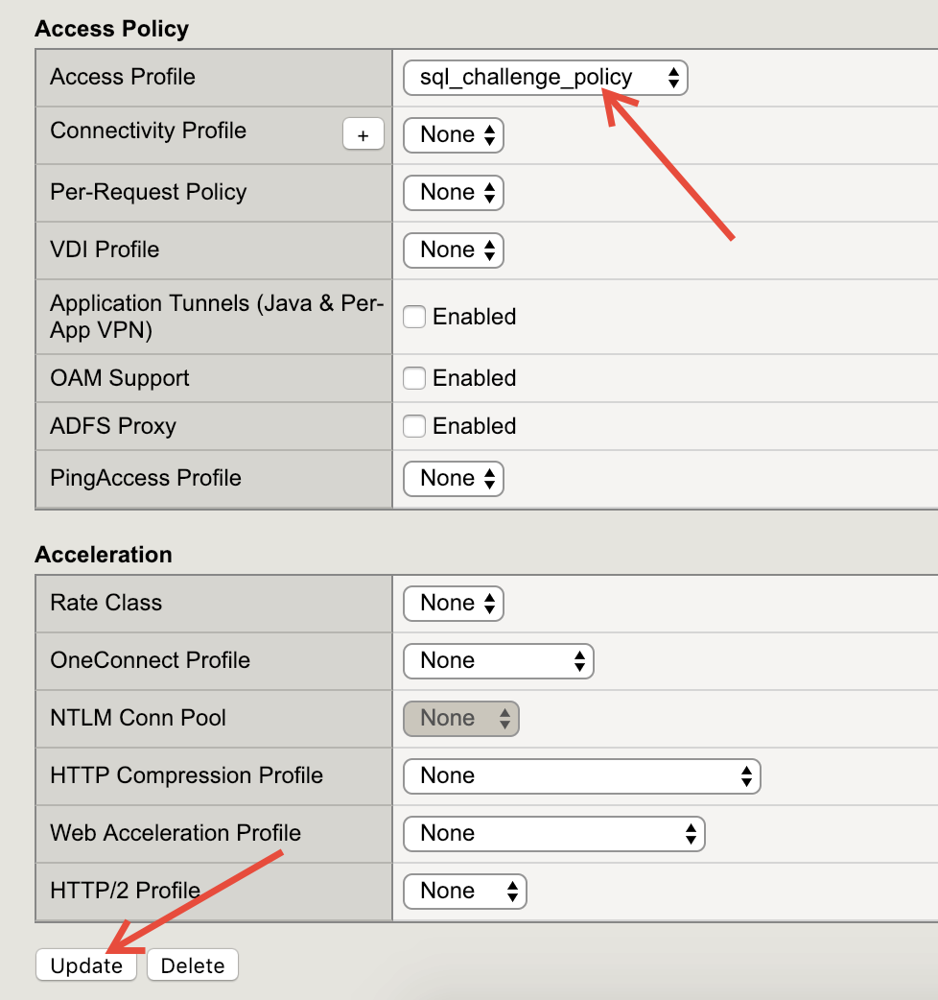

In your virtual server settings, click the Resources tab on top. Click the Manage button in the iRules section.

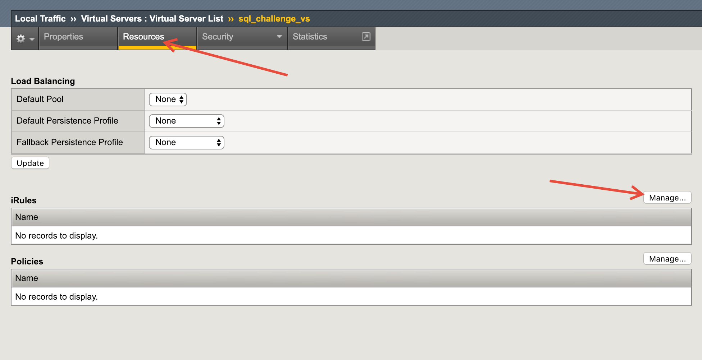

Select the sql_challenge_irule, move it to the Enabled box by clicking the << button, then click Finished.

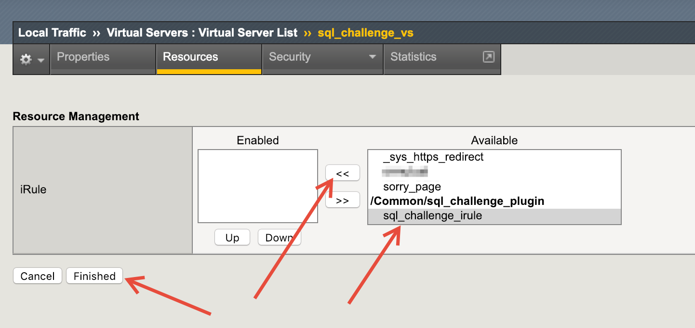

Finally, browse to the ip address or hostname of your virtual server to see the SQL Challenge in action!

# Supplemental Learning

[F5 Access Policy Manager](https://www.f5.com/products/security/access-policy-manager)

[Getting started with iRulesLX](https://devcentral.f5.com/articles/getting-started-with-irules-lx-introduction-conceptual-overview-20409)
 
[Introduction to iRulesLX Lab](https://clouddocs.f5.com/training/community/irules/html/class3/class3.html)
 